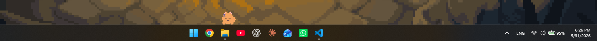
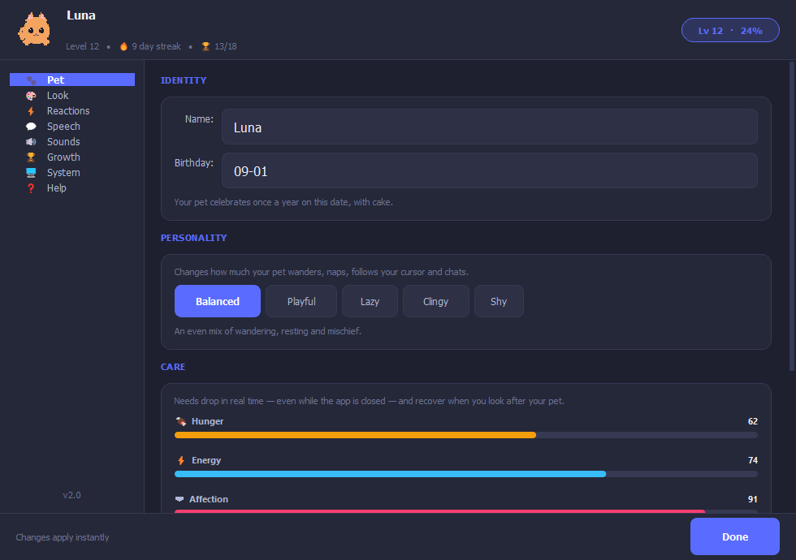
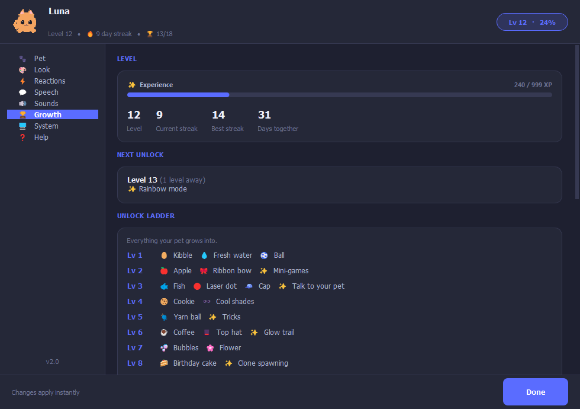
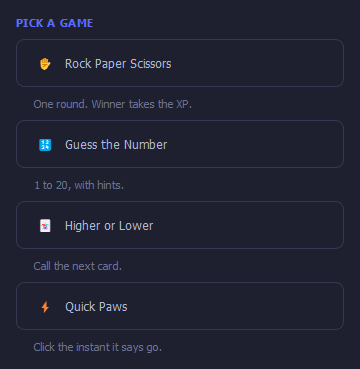
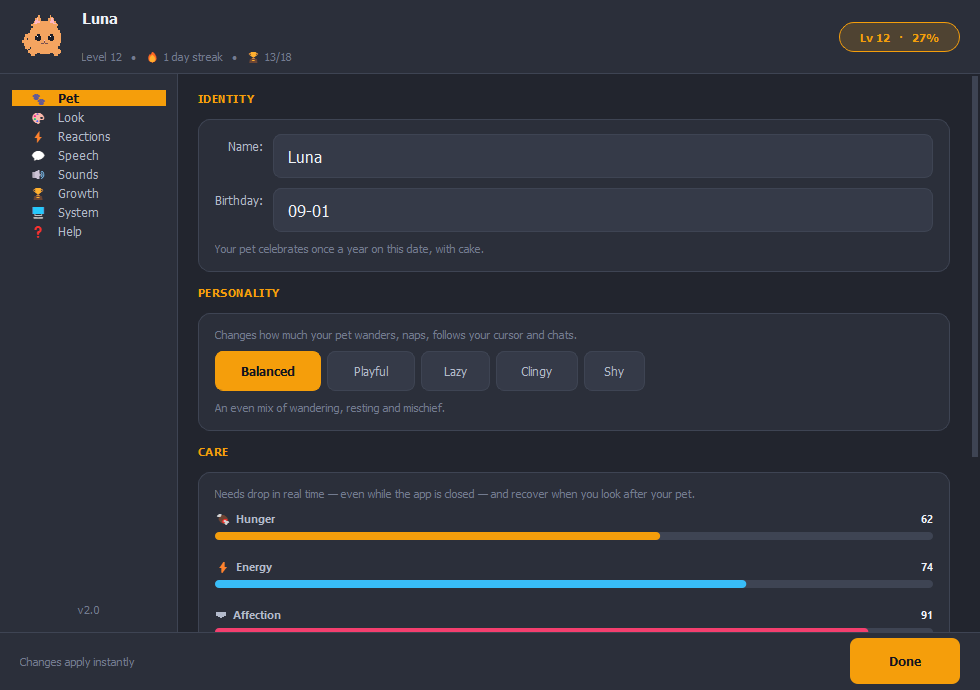
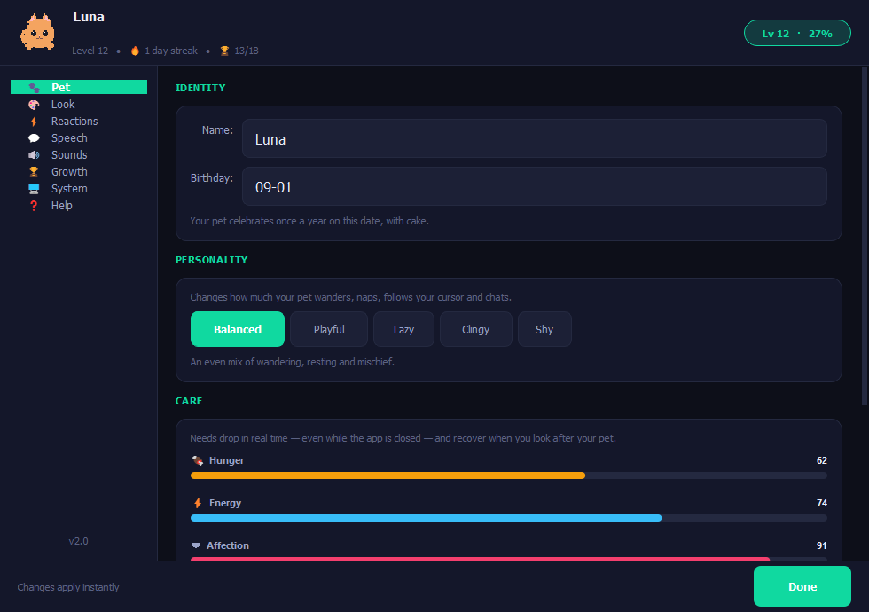
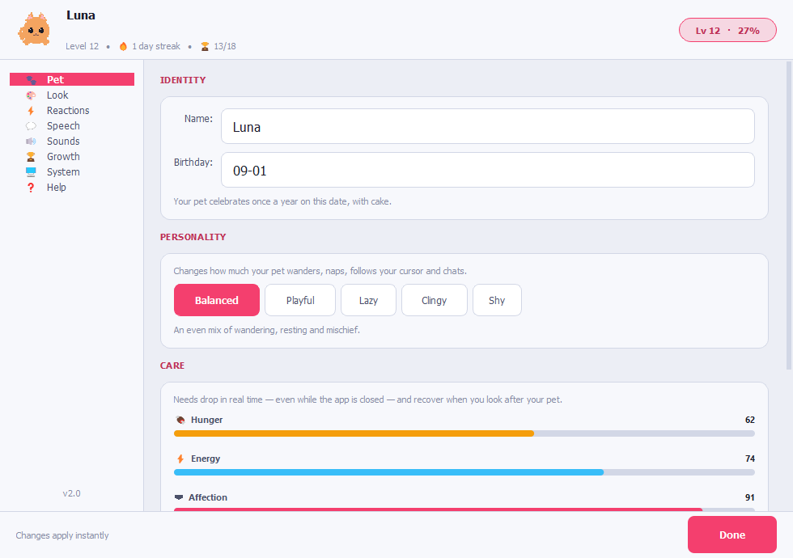
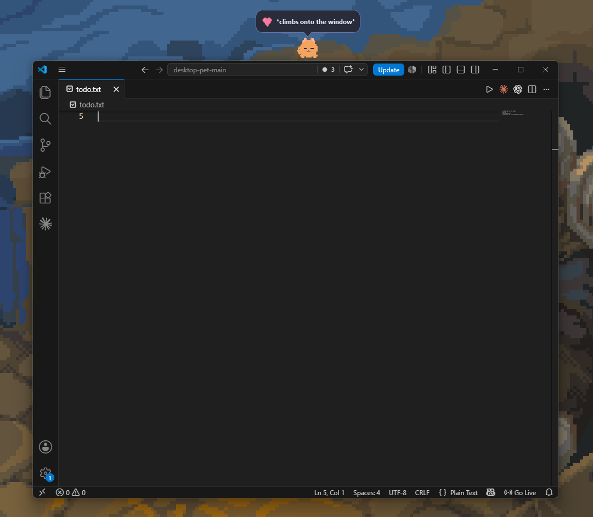
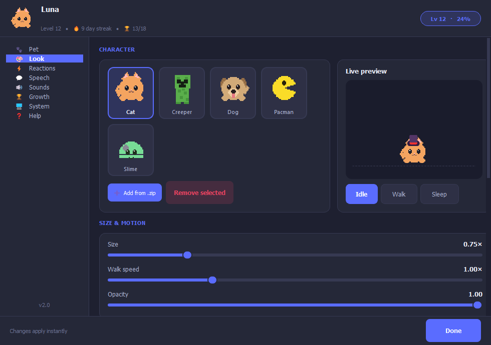
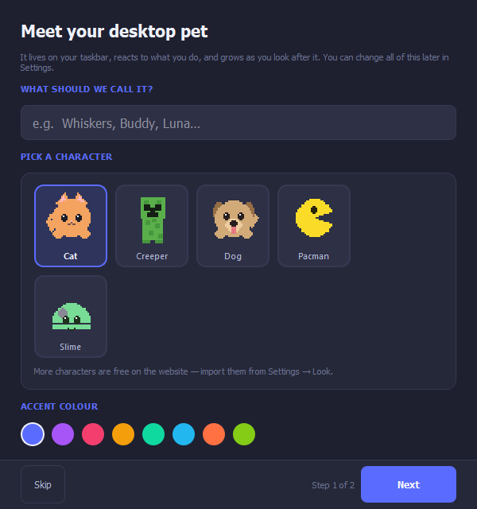

# Desktop Pet

**A companion that lives on your Windows taskbar — and actually grows with you.**

Feed it, play with it, level it up. It reacts to your battery, the weather
outside, your downloads, how long you've been idle, and the windows you have
open. Close the laptop, come back tomorrow, and it remembers.

<p align="center">
  <a href="../../releases/latest"></a>
</p>

<p align="center">
  <a href="../../releases/latest"></a>
  <a href="../../releases"></a>
  
  
</p>

<p align="center">
  
</p>

---

## Get it

**[Download the latest .exe](../../releases/latest)** — one portable file,
no installer, nothing else to run.

On first launch it asks you to name your pet, pick a look, and choose whether
it starts with Windows. That's the whole setup.

> Windows may show a SmartScreen warning. Click **More info**, then
> **Run anyway**. That's normal for a new app that hasn't built up download
> reputation yet — not a sign anything's wrong.

---

## Why people keep it running

A desktop pet is usually a toy you forget about in a day. This one is built
to still matter in a month:

- **It's a real pet, not a decoration.** Hunger, energy and affection drop on
  a real clock — even while the app is closed, capped at 16 hours so a
  weekend away isn't punishing. Neglect it and it notices; take care of it
  and it shows.
- **There's always a next thing to unlock.** 30 levels, 18 achievements,
  growing daily streaks, and new food, toys, hats and features tied to
  progress — not everything is handed to you on day one.
- **It pays attention to your actual PC.** Battery level, active downloads,
  idle time, File Explorer, fullscreen apps, live weather for your city
  (no account or API key needed), your pet's own birthday once a year,
  and the seasons — snow, cherry blossom, autumn leaves.
- **It talks back.** Type to it and it answers in character, based on mood.
  Teach it to sit, spin, jump, dance and play dead.

<table>
<tr>
<td width="50%"></td>
<td width="50%"></td>
</tr>
<tr>
<td align="center"><sub>Hunger, energy and affection, always visible on hover</sub></td>
<td align="center"><sub>30 levels of progress, achievements, and daily streaks</sub></td>
</tr>
</table>

---

## Play with it

- **Direct interaction** — left-click to pat, drag to move, throw to fling,
  shake it to annoy it.
- **Four mini-games** — rock paper scissors, guess the number, higher or
  lower, and a reaction test, all from the right-click menu.
- **Real toys** — a ball that falls, bounces and rolls, and a laser dot that
  darts away until it's caught. Actual physics, not a looping animation.
- **Gags** — balloon, rocket, portal, moonwalk, freeze, cursor steal, and
  more, for when you just want to mess with it.
- **Productivity tools, because it's already on your screen** — quick notes,
  a to-do list, a countdown/Pomodoro timer, reminders.

<p align="center">
  
</p>

---

## Make it yours

24+ characters — from a plain cat, dog and slime to fan-made packs — a size
slider that snaps to sharp, whole-pixel zoom no matter how big or small you
go, and accessories (bows, caps, shades, hats, crowns) that unlock as you
level up.

Eight accent colors across four backgrounds, retinting every window,
including the pet's own speech bubble style (cloud, square or pixel).

<table>
<tr>
<td width="33%"></td>
<td width="33%"></td>
<td width="33%"></td>
</tr>
</table>

Want your own character on your desktop? A character is just a folder of PNG
frames plus a `config.json`, zipped — see
[Adding your own character](#adding-your-own-character) below.

---

## Built to stay out of your way

- **Window sitting** — climbs onto the top edge of whatever app you have open.
- **Magnet mode** — attract or repel it with your cursor.
- **Multiple pets** — spawn more than one and let them interact with each other.
- **Fullscreen hide** — gets out of the frame during games and video.
- **Click-through, always-on-top, opacity and lock-position controls**, all
  applied instantly from settings — no OK/Cancel round trip.

<table>
<tr>
<td width="50%"></td>
<td width="50%"></td>
</tr>
</table>

---

## An account is optional — and it does one real thing

You never need to sign in to use Desktop Pet. If you do, your pet's name,
level, XP, achievements and settings follow you to another machine and
survive a reinstall. That's it — no payment, no telemetry, no AI tracking
your usage. The update checker asks GitHub once a day whether a newer
release exists; it can be switched off.

<p align="center">
  
</p>

---

## Adding your own character

A character is a folder of square pixel-art frames plus a `config.json`,
zipped:

```text
mycharacter/
  config.json
  idle/    frame_00.png, frame_01.png, ...
  walk/    frame_00.png, ...
  sleep/   frame_00.png, ...
  fall/    frame_00.png, ...
  sounds/  walk.wav, land.wav, grab.wav, sleep.wav   (optional)
```

The bundled characters are 32×32 — art whose height divides evenly into the
display size stays sharp, since sprites are drawn at whole-number zoom.

In the app: **right-click the pet → Settings → Look → ➕ Add character (.zip)**.

`config.json` sets the name, personality, animation speeds, walk speed and
the lines your character says. Copy one from
[the latest release](../../releases/latest) and edit it.

---

## What this repository is

This repo hosts the downloadable `.exe` builds of Desktop Pet — see
[Releases](../../releases) — plus the community character packs the app
links to.

The application's own source lives elsewhere and isn't public. The app
checks this repository's releases once a day to tell you when a newer
version exists, so the release tags here are load-bearing: the download
button above and the in-app update checker both point at them.

---

## Reporting a problem

Open an [issue](../../issues), or email
[Support@desktop-pet.online](mailto:Support@desktop-pet.online). Useful
details: your Windows version, what the pet was doing, and whether it
happens every time.

---

## License

Desktop Pet is proprietary — all rights reserved. Character packs
distributed through the releases here are the work of their respective
creators and are provided for personal use.
